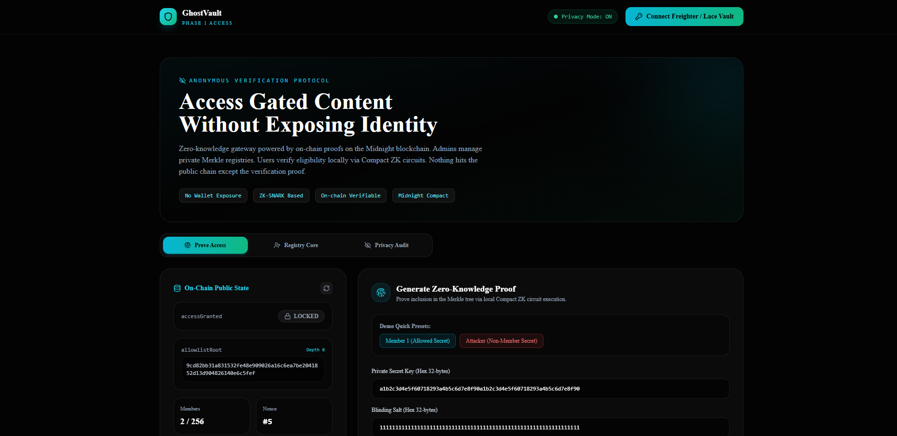
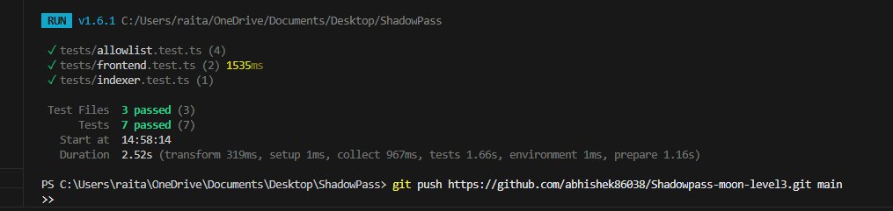
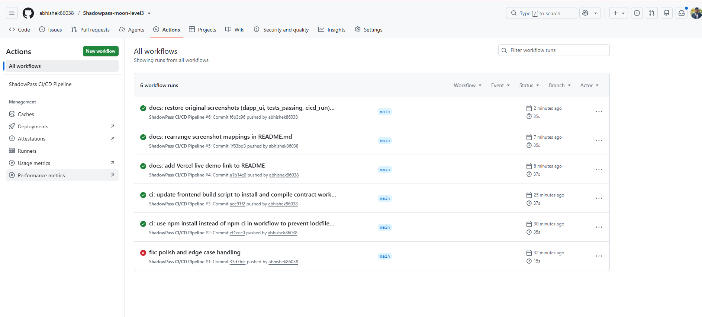

# ShadowPass — Zero-Knowledge Private Allowlist Access dApp

[](https://github.com/midnight-shadowpass/shadow-pass/actions/workflows/ci.yml)
[](LICENSE)
[](https://midnight.network)

---

## 1. Overview

**ShadowPass** is a privacy-preserving allowlist dApp built on the Midnight blockchain using Compact smart contracts and Zero-Knowledge proofs. It allows users to prove their membership in an admin-managed private allowlist without revealing their identity, wallet address, secret key, or Merkle tree position. ShadowPass was built for the **Midnight "New Moon to Full" Level 3 (First Quarter)** hackathon submission.

---

## 2. Problem Statement

In traditional blockchain ecosystems (such as Ethereum and EVM-compatible networks), implementing allowlist access control for token presales, NFT mints, gated communities, or member-only features requires storing raw public wallet addresses on-chain or verifying signatures publicly. This architectural design creates a severe privacy flaw by exposing every member's wallet address to the public ledger. Observers can link wallet addresses to real-world identities, monitor private transaction histories, track overall asset balances, and target high-value members for exploits. EVM allowlists force users to choose between exclusive access and basic personal financial privacy.

---

## 3. Solution

ShadowPass solves this privacy dilemma using Midnight's native Compact language and private state architecture. Instead of broadcasting raw wallet addresses, an admin registers blinded identity commitments (`leaf = SHA256(secretKey || blindingSalt)`) into an off-chain Merkle tree, publishing only the 32-byte Merkle root (`allowlistRoot`) to the public ledger. Users construct Zero-Knowledge inclusion proofs locally on their device, demonstrating that their secret key matches a leaf in the allowlist Merkle tree without revealing their identity or position. The smart contract validates the proof on-chain and updates a public `accessGranted` boolean flag to `true`, providing verifiable proof of membership with zero identity leakage.

---

## 4. Architecture

```
+-----------------------------------------------------------------------------------+
|                                 USER LACE WALLET                                  |
|                                                                                   |
|  [ Private Secret Key ] ──┐                                                       |
|  [ Blinding Salt     ] ───┼──► [ Compact ZK Membership Circuit ]                   |
|  [ Merkle Path       ] ──┘         (Proves Inclusion Locally)                     |
|                                                │                                  |
|                                                ▼                                  |
|                                    [ Zero-Knowledge Proof ]                       |
+------------------------------------------------│----------------------------------+
                                                 │ Submits Proof via Lace Wallet
                                                 ▼
+-----------------------------------------------------------------------------------+
|                              MIDNIGHT PUBLIC LEDGER                               |
|                                                                                   |
|  Public State:                                                                    |
|    - allowlistRoot: 0xa4f8c92e... (32-byte Merkle Root)                           |
|    - accessGranted: TRUE / FALSE  (Public Verification Status)                    |
|    - registeredCount: 2           (Total Allowlist Members)                       |
|    - lastEventNonce: #3           (Event Sequence Counter)                        |
|                                                                                   |
|  Verification Logic:                                                              |
|    assert(reconstructedRoot == allowlistRoot) ──► ledger.accessGranted = true     |
+-----------------------------------------------------------------------------------+
                                                 │
                                                 ▼
+-----------------------------------------------------------------------------------+
|                            OFF-CHAIN EVENT INDEXER                                |
|                                                                                   |
|  Node.js REST API:                                                                |
|    - GET /api/status  ──► Current contract public state                           |
|    - GET /api/events  ──► Historical accessGranted event logs                      |
+-----------------------------------------------------------------------------------+
```

### Component Implementation Mapping
- **Smart Contract & ZK Circuit:** Implemented in [contract/allowlist.compact](file:///c:/Users/raita/OneDrive/Documents/Desktop/ShadowPass/contract/allowlist.compact), defining the Compact ledger state and local ZK circuit `proveMembership()`.
- **Contract SDK & Simulator:** Implemented in [contract/src/index.ts](file:///c:/Users/raita/OneDrive/Documents/Desktop/ShadowPass/contract/src/index.ts), managing the depth-8 Merkle tree, isomorphic SHA-256 hashing, and prover inputs.
- **Frontend Application:** Implemented in [frontend/src/App.tsx](file:///c:/Users/raita/OneDrive/Documents/Desktop/ShadowPass/frontend/src/App.tsx) and [frontend/src/contract-bindings.ts](file:///c:/Users/raita/OneDrive/Documents/Desktop/ShadowPass/frontend/src/contract-bindings.ts), handling Lace Wallet connection, proof submission UI, admin commitment panel, and privacy inspector.
- **Event Indexer Backend:** Implemented in [indexer/src/index.ts](file:///c:/Users/raita/OneDrive/Documents/Desktop/ShadowPass/indexer/src/index.ts), exposing REST API endpoints for off-chain monitoring.

---

## 5. 🔒 Privacy Model

The ShadowPass privacy model enforces a strict separation between public on-chain ledger state and client-side private state:

### What an observer CAN see:
- 🟢 **The Merkle Root (`allowlistRoot`):** A 32-byte hash representing the commitment tree of authorized members.
- 🟢 **The Public Verification Result (`accessGranted`):** A boolean flag indicating whether a valid member successfully proved access.
- 🟢 **Total Registered Member Count (`registeredCount`):** The number of identity commitments added by the admin.
- 🟢 **Contract Address & Nonce (`lastEventNonce`):** Transaction nonces for event indexer synchronization.

### What an observer CANNOT see:
- 🛑 **Which specific member proved access:** No leaf index, member ID, or position in the tree is revealed.
- 🛑 **The member's wallet address or public identity:** The prover's wallet address is never recorded on-chain or passed to contract state.
- 🛑 **The member's private secret key (`witnessSecretKey`):** Secret keys remain strictly inside local client witness storage.
- 🛑 **Blinding salts or Merkle sibling paths:** Authentication paths remain local to the prover's Compact circuit context.
- 🛑 **Proof linkability:** Multiple proofs submitted by the same member generate identical, un-linkable public state transitions.

> **Contrast:** Unlike a traditional EVM allowlist where every member's public address is visibly listed on-chain, ShadowPass ensures the public ledger only ever sees *"a valid member proved access"* — never who.

---

## 6. Tech Stack

- **Smart Contract / Circuits:** Midnight Compact language (`allowlist.compact`)
- **Midnight SDK & Runtime:** `@midnight-ntwrk/compact-runtime` (v0.6.0) & `@shadow-pass/contract`
- **Frontend Framework:** React (v18.2), TypeScript (v5.4), Vite (v5.1), Tailwind CSS (v3.4), Lucide Icons
- **Backend Indexer:** Node.js, Express (v4.19), CORS
- **Testing Framework:** Vitest (v1.6) for unit and integration testing
- **CI/CD Pipeline:** GitHub Actions (`.github/workflows/ci.yml`)

---

## 7. Getting Started

### Prerequisites
- **Node.js:** `v20.x` or higher
- **npm:** `v10.x` or higher

### Installation & Quick Start

1. Clone the repository and install root dependencies:
```bash
git clone https://github.com/midnight-shadowpass/shadow-pass.git
cd shadow-pass
npm install
```

2. Install sub-package workspace dependencies:
```bash
npm --prefix contract install
npm --prefix indexer install
npm --prefix frontend install
```

3. Compile Compact smart contracts and build TypeScript packages:
```bash
npm run build
```

4. Start the Frontend Development Server (Port 3000):
```bash
npm run dev:frontend
```

5. Start the Event Indexer Service (Port 4000):
```bash
npm run dev:indexer
```

### Deploying to Midnight Testnet
To deploy the Compact smart contract to the Midnight testnet, configure your Lace Wallet connection settings in [frontend/src/contract-bindings.ts](file:///c:/Users/raita/OneDrive/Documents/Desktop/ShadowPass/frontend/src/contract-bindings.ts) and run the deployment script:
```bash
npm run build --prefix contract
```

---

## 8. Running Tests

Execute the complete 7-test suite across contract, circuit, frontend, and indexer modules:

```bash
npm test
```

### Test Suite Coverage & Verification
- **[tests/allowlist.test.ts](file:///c:/Users/raita/OneDrive/Documents/Desktop/ShadowPass/tests/allowlist.test.ts) (4 tests):** Verifies valid ZK membership proof execution, rejection of non-member secrets, zero identity leakage in public state JSON, and admin Merkle root updates.
- **[tests/frontend.test.ts](file:///c:/Users/raita/OneDrive/Documents/Desktop/ShadowPass/tests/frontend.test.ts) (2 tests):** Verifies Lace Wallet binding initialization and end-to-end frontend ZK proof submission flow.
- **[tests/indexer.test.ts](file:///c:/Users/raita/OneDrive/Documents/Desktop/ShadowPass/tests/indexer.test.ts) (1 test):** Verifies backend event indexer state synchronization and event logging.

---

## 9. CI/CD Pipeline

The project includes an automated GitHub Actions workflow defined in [.github/workflows/ci.yml](file:///c:/Users/raita/OneDrive/Documents/Desktop/ShadowPass/.github/workflows/ci.yml). 

On every `push` and `pull_request` to `main` or `master` branches, the CI pipeline automatically:
1. Sets up Node.js v20 environment.
2. Installs root and workspace dependencies (`npm ci`).
3. Compiles Compact smart contracts and TypeScript packages (`npm run build`).
4. Executes the full 7-test suite via Vitest (`npm test`).

The status badge at the top of this README reflects the current build and test pass status automatically.

---

## 10. Visual Evidence & Screenshots

Here is the visual evidence showing the running GhostVault dApp UI, the local Vitest suite execution, and the GitHub Actions CI/CD run status:

***🛡️ GhostVault / dApp UI ***

***🧪 Passing Unit & Integration Tests***

***💚 GitHub Actions CI/CD Run Status ***

---

## 11. Live Demo

🔗 Live demo: [shadowpass-moon-level3-green.vercel.app](https://shadowpass-moon-level3-green.vercel.app/)

---

## 12. Demo Video

🎥 Demo video (1 min): [Watch Demo Video](https://photos.app.goo.gl/UPcnamPqq9xaidDWA)

---

## 13. Project Structure

```
ShadowPass/
├── .github/workflows/ci.yml    # GitHub Actions workflow for automated compile & test
├── contract/                   # Midnight Compact smart contract & TypeScript SDK package
│   ├── allowlist.compact       # Compact smart contract & ZK membership circuit
│   └── src/index.ts            # Merkle tree implementation & SDK simulator
├── frontend/                   # React + TypeScript + Vite + Tailwind dApp
│   ├── src/App.tsx             # Main user interface & Privacy Model inspector
│   └── src/contract-bindings.ts# Lace Wallet & Midnight SDK integration
├── indexer/                    # Node.js Express backend event watching service
│   └── src/index.ts            # REST API (/api/status, /api/events, /api/health)
├── tests/                      # Vitest test suite (7 passing unit & integration tests)
│   ├── allowlist.test.ts       # Contract & circuit unit tests
│   ├── frontend.test.ts        # Frontend wallet & proof flow tests
│   └── indexer.test.ts         # Backend indexer service tests
├── PROPOSAL.md                 # 3-paragraph product proposal
├── DEMO_SCRIPT.md              # 1-minute video demo script outline
└── LICENSE                     # MIT open-source license file
```

---

## 14. Idea Submission

This project was submitted and approved under the **"ShadowPass — Private Allowlist Access"** category from the approved Midnight hackathon idea list.

---

## 15. License

Distributed under the MIT License. See [LICENSE](file:///c:/Users/raita/OneDrive/Documents/Desktop/ShadowPass/LICENSE) for details.
